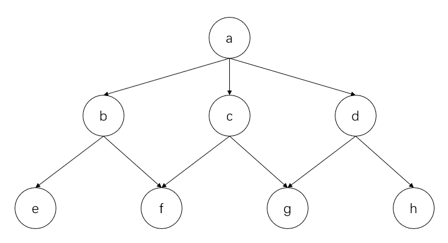

# Depth First Search Path Traversal
## Target
For the tree structure in the figure below, traverse and output the path from all leaf nodes to the root node.

# Acknowledgement
深度搜索算法（python实现）获取所有叶子节点到根节点的路径

https://www.codeleading.com/article/21464801118/
